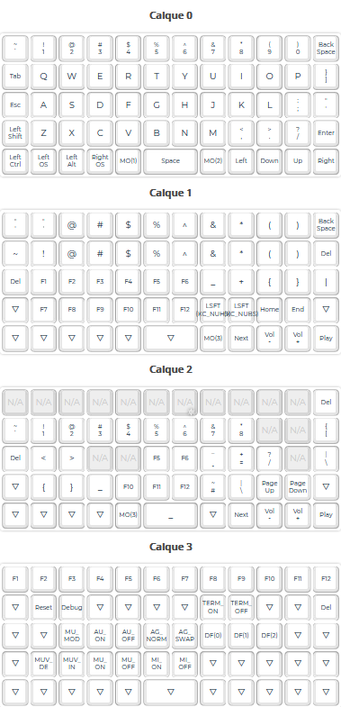

# Preonic bépo layout

Source files for my bépo layout.

Targeting a preonic keyboard with a single space bar taking 2 keys centered (`1x2uC`).

It is supposed to work on a system configured as `fr_bepo` or wathever the system is calling the bepo variant.

## Resources

* [QMK Configuratior](https://config.qmk.fm/#/preonic/rev3/LAYOUT_preonic_1x2uC)

## Preview

